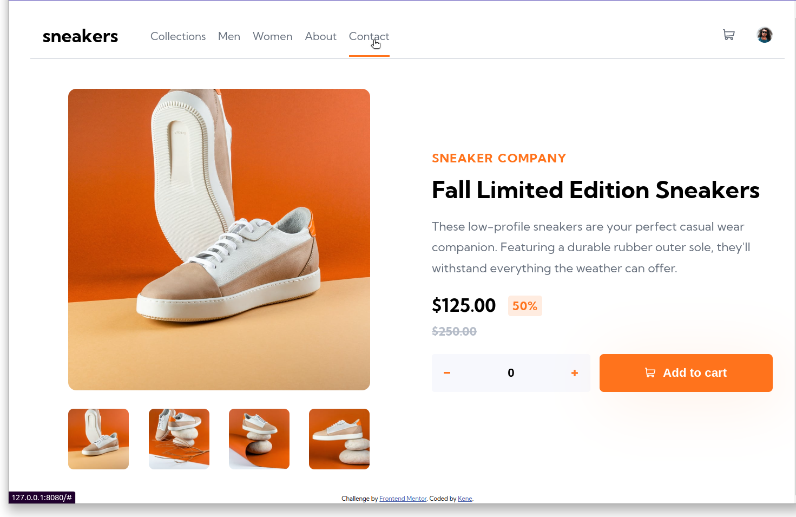

# Frontend Mentor - E-commerce product page solution

This is a solution to the [E-commerce product page challenge on Frontend Mentor](https://www.frontendmentor.io/challenges/ecommerce-product-page-UPsZ9MJp6). Frontend Mentor challenges help you improve your coding skills by building realistic projects.

## Table of contents

- [Overview](#overview)
  - [The challenge](#the-challenge)
  - [Screenshot](#screenshot)
  - [Links](#links)
- [My process](#my-process)
  - [Built with](#built-with)
  - [What I learned](#what-i-learned)
  - [Useful resources](#useful-resources)
- [Author](#author)
- [Acknowledgments](#acknowledgments)

## Overview

### The challenge

Users should be able to:

- View the optimal layout for the site depending on their device's screen size
- See hover states for all interactive elements on the page
- Open a lightbox gallery by clicking on the large product image
- Switch the large product image by clicking on the small thumbnail images
- Add items to the cart
- View the cart and remove items from it

### Screenshot



### Links

- Solution URL: [Click here...](https://github.com/kenebebh/E-commerce-product-page)
- Live Site URL: [Click here...](https://fem-e-commerce-489a62.netlify.app/)

## My process

### Built with

- Semantic HTML5 markup
- SASS
- CSS
- Flexbox
- CSS Grid
- Mobile-first workflow

### What I learned

- Practiced the use of helper classes, just like in tailwind, but i created these myself. This project was a simple one, so my helper classes were just mostly to set the display to flex and specify the justify-content and align-items property

```html
<div class="body-container flex fd-c jc-c"></div>
```

```html
<header class="header flex jc-sb ai-c"></header>
```

- In mobile devices with small widths, this property makes any overflow display the ellipsis [...]

```css
.cart-main-details {
  overflow: hidden;
  white-space: nowrap;
  text-overflow: ellipsis;
}

.product-name__cart {
  overflow: hidden;
  white-space: nowrap;
  text-overflow: ellipsis;
}
```

- This function creates a media condition that targets viewports at least 900px wide, it is then used to implement certain functions and event listeners only when were on tablets and other wider screens

```js
const mediaQueryTablets = window.matchMedia("(min-width: 900px)");
// Check if the media query is true
if (mediaQueryTablets.matches) {
  // Then trigger an alert
  console.log("Media Query Matched!");
}
```

### Useful resources

- [Jonas Schmedtmann's Javascript course](https://www.udemy.com/the-complete-javascript-course/?couponCode=C3RESOURCES1010) really helped me alot in adding functionality to the page.

- [Jonas Schmedtmann's Advanced CSS and SASS course](https://www.udemy.com/advanced-css-and-sass/?couponCode=RESOURCES4) also taught me how to plan for and structure my html and how to position elements beautifully on the page

## Author

- Frontend Mentor - [@kenebebh](https://www.frontendmentor.io/profile/kenebebh)
- Twitter - [@BanigoKene](https://twitter.com/BanigoKene)

## Acknowledgments

- A huget thanks to my friends [Toye](https://twitter.com/adetoye_dev) and [James](https://twitter.com/TheBlackCoder7). They always help and support my progress and give me useful comments on everything i build
